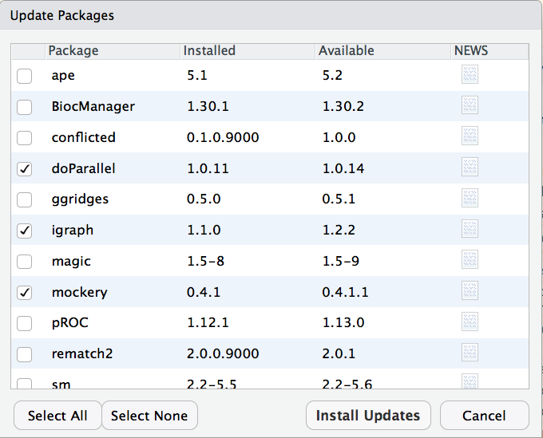
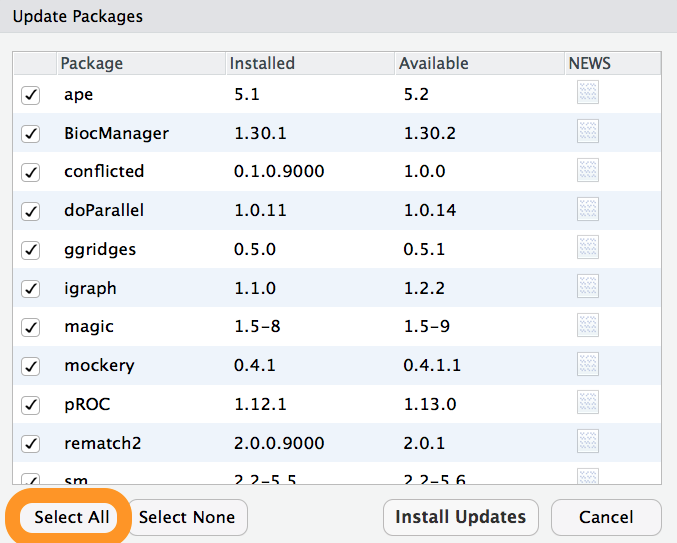

# Maintaining R

## How to upgrade an installed package to the latest version.

Sometimes you would like to upgrade a particular package to the latest
available version. Often this is because you have heard about a new feature, or
maybe you have run into a bug that may have been fixed.

### In RStudio



### R terminal

Devtools has a function `update_packages()` which will upgrade a package (from
the same source) for _any_ CRAN or development package.

`devtools::update_packages("pkgname")`

In addition if the given package is _not_ already installed it will install it.

## How to upgrade all out-of-date packages

### In RStudio



### CRAN packages

`devtools::update_packages(TRUE)`

## How to downgrade a package

First if unsure what version -> [CRAN page](https://cran.r-project.org/web/packages/devtools/index.html) -> [pkgname archive](https://cran.r-project.org/src/contrib/Archive/devtools/)

```r
devtools::install_version("devtools", "1.13.3")
```

## How to transfer your library when updating R

Often you will not need to do anything when updating R. For 'patch' R versions,
the 'z' in 'x.y.z' the R core developers ensure package compatibility across
versions. So if you are updating from R 3.5.0 to R 3.5.1 you can use the same
packages you are currently using.

For 'minor' version changes, the 'y' in 'x.y.z' the package interface _can_
change, so packages need to be re-installed.

```{block type="rmdwarning"}
You may see some suggestions that you can just copy your packages even when the
'minor' version changes. **DO NOT DO THIS**. While it may work some (even most)
of the time, R-core does not guarantee compatibility between these versions and
things could break (even break silently).
```

I suggest you keep the packages R comes with (base and recommended)
packages separate from the rest of your packages. This makes it easy to
re-install R if needed without touching your CRAN packages. You also want to
make sure the package library is specific to the minor version of R.

`R_LIBS_USER` is actually set by default to this scheme, (to
`~/R/win-library/x.y` on Windows and `~/Library/R/x.y/library` on macOS) but
the directory may not already exist, so one option is just to create this
directory (`fs::dir_create(Sys.getenv("R_LIBS_USER"))`).

You can also alternatively set `R_LIBS_USER` to a different path; but make sure
to include the `%v` wildcard. e.g. `~/R/library/%v`. The `%v` is
automatically expanded to the major and minor version of R, so with R 3.5.1
this path becomes `~/Library/R/3.5/library`. See [Renviron](#renviron) for how
to edit your `.Renviron` file.

```{block type = "rmdwarning"}
Paths in `R_LIBS_USER` are only used if the directories they specify actually
exist. So in addition to adding `R_LIBS_USER` to your `.Renviron` you need to
create the directory as well.
```

Once this is setup, the process for transferring your package library becomes.
(assumes `R_LIBS_USER` is set to `~/Library/R/3.5/library`).

```r
# Install new version of R (lets say 3.5.0 in this example)

# Create a new directory for the version of R
fs::dir_create("~/Library/R/3.5/library")

# Re-start R so the .libPaths are updated

# Lookup what packages were in your old package library
pkgs <- fs::path_file(fs::dir_ls("~/Library/R/3.4/library"))

# Filter these packages as needed

# Install the packages in the new version
install.packages(pkgs)
```
